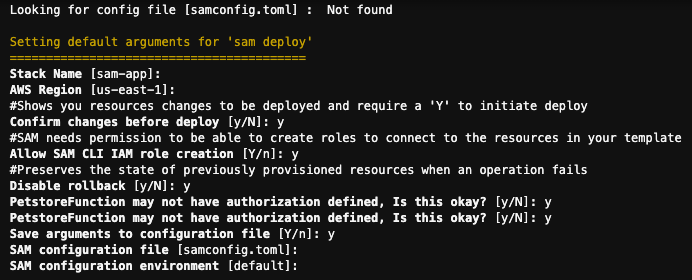
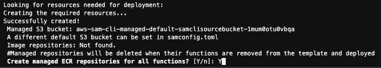
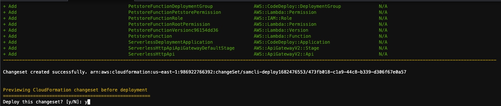
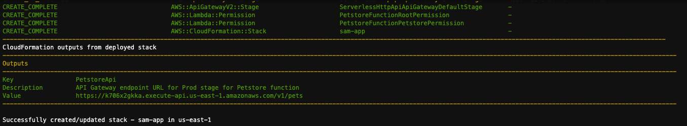

# Serverless Lambda Container Lab instruction


The note will demonstrate how to leverage AWS Lambda Container runtime to run legacy Java Spring boot application.
In order to simplify the efforts of re-engineering,
we will use the lambda-web-adapter library to proxy the requests and route to the backend containerized Java application.
The overall architecture will rely on API Gateway, Lambda function, and IAM appropriate policy settings.

Reference Lab : https://github.com/awslabs/aws-lambda-web-adapter

Lab instructions


### 1 - Create Cloud 9 on AWS Console

We have to visit the event engine portal and login.
After login successfully, we have to do some essential tools installation and update.


```
Update all of the lib distributions repository. 

$ sudo yum -y update
```


```
AWS CLI V2 installation

curl "https://awscli.amazonaws.com/awscli-exe-linux-x86_64.zip" -o "awscliv2.zip"
unzip awscliv2.zip
sudo ./aws/install

after the installation completed, close the terminal and restart a new one, then check the AWS CLI version by : 

aws --version

```

You should get the result :

TeamRole:~/environment $ aws —version
aws-cli/2.11.15 Python/3.11.3 Linux/4.14.311-233.529.amzn2.x86_64 exe/x86_64.amzn.2 prompt/off
TeamRole:~/environment $


```
Check AWS SAM-CLI version

$ sam --version

```

You should get: SAM CLI, version 1.72.0


```
Check Java --version

$ Java --version

By default, this should be Corretto-11.0.18.10.1
```


```
Maven installation

sudo wget http://repos.fedorapeople.org/repos/dchen/apache-maven/epel-apache-maven.repo -O /etc/yum.repos.d/epel-apache-maven.repo
sudo sed -i s/\$releasever/6/g /etc/yum.repos.d/epel-apache-maven.repo
sudo yum install -y apache-maven

Check Mave version

mvn --version
```

you should got : Apache Maven 3.5.2 (138edd61fd100ec658bfa2d307c43b76940a5d7d; 2017-10-18T07:58:13Z)


### 2—Download the sample Code

```
make sure your current path is under ~/environment .

$ git clone https://github.com/awslabs/aws-lambda-web-adapter.git

```

Today, we are going to build the sample from spring boot, change directory to

```
cd /home/ec2-user/environment/aws-lambda-web-adapter/examples/springboot

```


### 3—Deal with the container prerequisite

```
$ aws ecr-public get-login-password --region us-east-1 | docker login --username AWS --password-stdin public.ecr.aws
```

Go build the container


```
$ sam build
```


### 4 - Deploy the docker image on lambda

```
sam deploy --guided
```


System detected that you don’t have the ECR repository created, suggest to create one to persist the images.


System generated the necessary resources definition code, and request your approval to create


Deployed result :


### 5—Test the deployed application

```
curl https://k706x2gkka.execute-api.us-east-1.amazonaws.com/v1/pets
```


Result :

```
[{"id":"18a7a589-84bc-44a3-a8cc-b414c29dac14","breed":"Jack Russell Terrier","name":"Lily","dateOfBirth":1595385737174},{"id":"849baad5-6e02-467c-8fce-c7d4413f5674","breed":"Afghan Hound","name":"Harley","dateOfBirth":1248576137174},{"id":"27d0e7e8-3233-43b3-8034-2e773e04dd43","breed":"Jack Russell Terrier","name":"Max","dateOfBirth":1398912137174},{"id":"b0cfee67-48c2-460b-ace6-49a610a471db","breed":"Bernese Mountain Dog","name":"Angel","dateOfBirth":1211596937174},{"id":"f4d7249a-9883-4edb-ab98-0b7109f3bc34","breed":"Beagle","name":"Ginger","dateOfBirth":1544496137174},{"id":"7a5bb7d9-471c-4985-b52c-0657e79f9014","breed":"Bloodhound","name":"Lily","dateOfBirth":1444185737174},{"id":"ed879a8e-c4c3-4442-ac04-363af87cea7f","breed":"Dalmatian","name":"Zoe","dateOfBirth":1400899337174},{"id":"bf4e10d0-3b44-4c78-bee2-8bbf1e7002d2","breed":"Beagle","name":"Gracie","dateOfBirth":1282012937174},{"id":"27210507-d96b-4ad4-a8cb-a20df59348d5","breed":"Bloodhound","name":"Sadie","dateOfBirth":1336012937175},{"id":"265ae405-b987-483a-9852-f53c2a3c5b63","breed":"Afghan Hound","name":"Lily","dateOfBirth":1218422537175}]
```


### 6 - Run container locally test


```
docker run -d -p 8080:8080 986922766392.dkr.ecr.us-east-1.amazonaws.com/samapp7427b055/petstorefunction9b7680a9repo:petstorefunction-52b69a8b03fa-java8.al2-maven-v1
```

then test


```
curl localhost:8080/pets 
```

